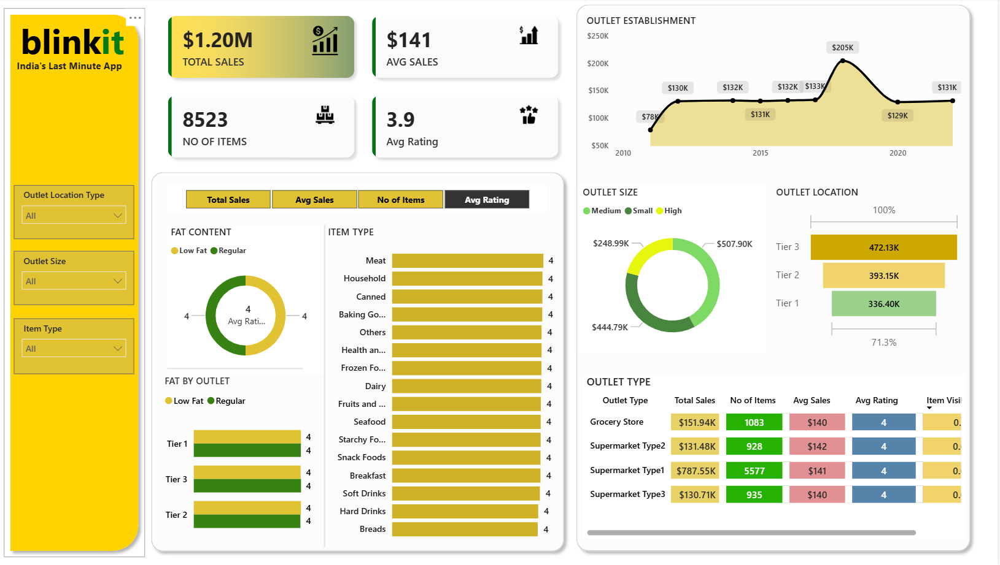

# Blinkit Grocery Sales Dashboard
## Tools: Power BI • DAX • Data Modelling

## Objective
Sales performance analysis for Blinkit (India's quick-commerce
platform) across outlet types, tiers, and product categories.

## Key metrics tracked
- Total Sales: $1.2M across 8,500+ items
- Avg Sales per item: $141 | Avg Rating: 3.9
- Outlet performance: Tier 1 / Tier 2 / Tier 3 breakdown
- 10-year outlet establishment trend (2010–2020)

## Features
- DAX KPIs for Total Sales, Avg Sales, Item Count, Rating
- Interactive slicers: Outlet Type, Location Tier, Item Type
- Drill-down from total to outlet-level insights

## Key findings
- Supermarket Type 1 has highest sales
- Tier 3 looks highest — $472K)
- Best performing item type by sales
